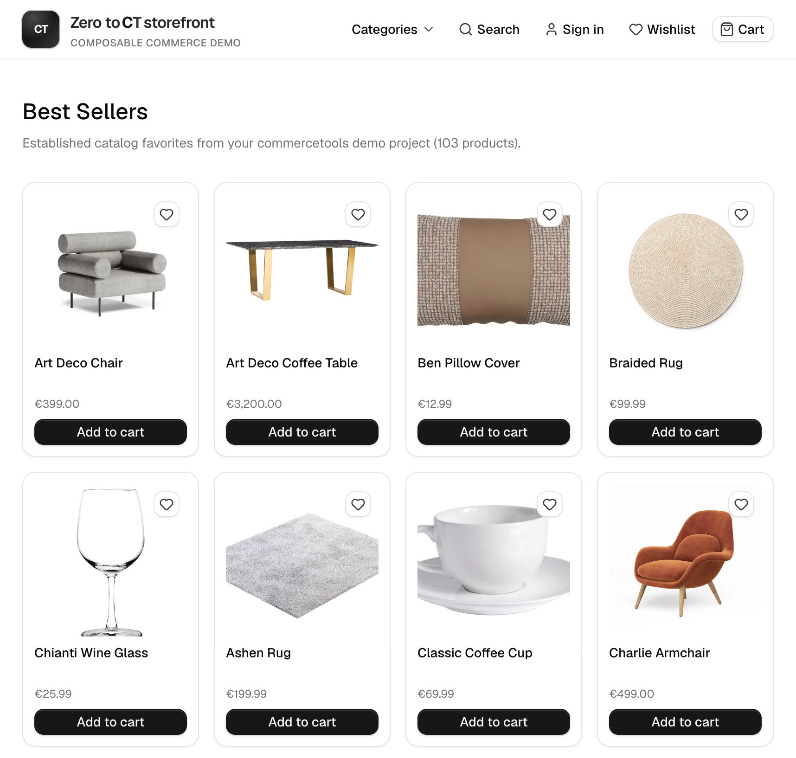

# zero-to-ct-storefront

A minimal B2C storefront on [commercetools](https://commercetools.com) Composable Commerce — built by a backend developer in ~2 weeks using AI agents and official CT tooling.

## Live demo

**https://zero-to-ct-storefront.vercel.app/**

[](https://zero-to-ct-storefront.vercel.app/)

## Status

✅ **PoC complete** (Phases 0–11) — live on Vercel with auto-deploy from `main`. No open storefront backlog.

Aligned with the [commercetools B2C Retail demo flow](https://docs.commercetools.com/tutorials/implementation-guide/demo-flow-b2c-retail) for discovery, account, and checkout. Phase history: [docs/ROADMAP.md](./docs/ROADMAP.md). Sales script: [docs/DEMO_SCRIPT.md](./docs/DEMO_SCRIPT.md).

**Talking point:** ~2 calendar weeks / ~42h net to a live B2C PoC.

## Project summary

| | |
|--|--|
| **Goal** | Agent-assisted B2C PoC on CT sample data, delivered by a backend-focused developer |
| **Calendar** | ~2 weeks (2026-07-08 → 2026-07-20, 8 working days) |
| **Net effort** | **~42h** ([TIME_REPORT.md](./docs/TIME_REPORT.md)) |
| **Agent share** | ~85–95% of storefront code; human owns CT project, Stripe/Connect, Merchant Center |
| **Architecture** | Next.js App Router BFF (`/app/api/*`) — CT credentials stay server-side |
| **Quality** | ~343 unit tests + ~37 E2E tests; CI (`lint`, `typecheck`, `test:unit`, `build`) |

### What shipped

- **Purchase path** — browse → cart → commercetools Checkout + Stripe → order confirmation → account
- **Discovery** — category nav + CLP, full-text search, facets, sort, pagination, autocomplete, Quick View, New Arrivals, Orders-ranked Best Sellers (catalog fallback)
- **Account** — register/login, cart merge, profile, addresses, password, order history + detail, Order again
- **Wishlist** — Shopping Lists, heart icon, move to cart, guest merge on auth
- **Promotions & stock** — product discounts, cart discount codes, in-stock / low-stock / OOS, mobile cart drawer
- **Multi-market** — DE/GB/US switcher, contextual prices, per-market parked carts, Checkout app mapping

### Out of scope (intentional)

- Email delivery / ESP (password-reset mail in production)
- Full catalog multilanguage (market switcher ships; product copy stays `en-GB` on sample data)
- Commerce MCP shopping assistant (IDE/ops tooling only — not shopper UX)
- Production-grade caching or a full design system

### Related PoCs

| Repo | Role |
|------|------|
| [commercetools-agentic-playbook](https://github.com/tomasz-miller/commercetools-agentic-playbook) | Capability map + recipes for CT AI tooling |
| [ct-agentic-connect](https://github.com/tomasz-miller/ct-agentic-connect) | Connect service / Cart API Extension (optional on this Project) |
| [commerce-ai-tool](https://github.com/tomasz-miller/commerce-ai-tool) | LLM voice / image / text product search widget |

## Documentation

| Doc | Description |
|-----|-------------|
| [AGENTS.md](./AGENTS.md) | Quick reference for AI coding agents |
| [docs/AGENT_CODING.md](./docs/AGENT_CODING.md) | Full agent-assisted development guide |
| [docs/TECH_STACK.md](./docs/TECH_STACK.md) | pnpm, ESLint, TypeScript SDK v3 |
| [docs/UI_COMPONENTS.md](./docs/UI_COMPONENTS.md) | coss ui primitives and conventions |
| [docs/CURSOR_SETUP.md](./docs/CURSOR_SETUP.md) | `.cursor/` directory setup (rules, MCP) |
| [docs/CHECKOUT.md](./docs/CHECKOUT.md) | Checkout + Stripe connector (MC, Connect, API client scopes) |
| [docs/DEMO_SCRIPT.md](./docs/DEMO_SCRIPT.md) | Sales demo script (use live URL above) |
| [docs/DEPLOY.md](./docs/DEPLOY.md) | Vercel deployment guide (auto-deploy from `main`) |
| [docs/ROADMAP.md](./docs/ROADMAP.md) | Phase history and capability inventory |
| [docs/TIME_REPORT.md](./docs/TIME_REPORT.md) | Estimated hours and milestones |
| [BUILD_LOG.md](./BUILD_LOG.md) | Chronological development log |

## Stack

| Layer | Technology |
|-------|------------|
| Runtime | Node.js `>= 22` |
| Package manager | **pnpm** `10.x` |
| Framework | Next.js (App Router) + TypeScript `strict` |
| Linting | ESLint (`eslint-config-next`) |
| Commerce API | [@commercetools/ts-client](https://docs.commercetools.com/dev-tooling/ts-sdk-getting-started) + `@commercetools/platform-sdk` v3 |
| Checkout | `@commercetools/checkout-sdk` + Checkout Browser SDK |
| UI | [coss ui](https://coss.com/ui) (Tailwind v4 + Base UI) |
| Data | B2C sample data (Lifestyle and Home) |

## Development

```bash
corepack enable
pnpm install
cp .env.example .env.local   # add CT credentials
pnpm dev
pnpm lint && pnpm typecheck
```

1. Install [commercetools AI plugin](https://github.com/commercetools/commercetools-ai-plugins) in Cursor
2. Set up `.cursor/` — see [docs/CURSOR_SETUP.md](./docs/CURSOR_SETUP.md)
3. Run `/nextjs-setup-project` (CT AI plugin) — **specify pnpm**

## License

See [LICENSE](./LICENSE).
