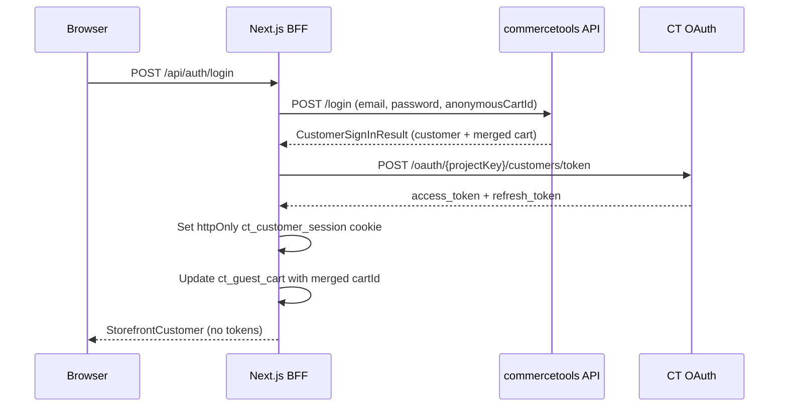

# Customer authentication

Customer sign-in, registration, password reset, and account management for **zero-to-ct-storefront**. All commercetools credentials and customer tokens stay on the server; the browser talks only to BFF routes under `/api/auth/*`.

## Architecture



## Session cookies

| Cookie | Purpose |
|--------|---------|
| `ct_customer_session` | httpOnly customer OAuth tokens + `customerId` + `expiresAt` |
| `ct_guest_cart` | Guest cart `anonymousId` + `cartId` (updated after login/register merge) |

Tokens never reach the client JavaScript bundle.

## BFF routes

| Route | Method | Description |
|-------|--------|-------------|
| `/api/auth/login` | POST | Sign in; merges guest cart when present |
| `/api/auth/register` | POST | Create account; merges guest cart when present |
| `/api/auth/logout` | POST | Clear customer session and browser cart cookie |
| `/api/auth/session` | GET | Safe customer profile DTO or `null` |
| `/api/auth/forgot-password` | POST | Request password reset token |
| `/api/auth/reset-password` | POST | Set new password from token |
| `/api/customer/orders` | GET | Authenticated order history (`limit`, `offset`) |
| `/api/customer/profile` | PATCH | Update first name, last name, email (`POST /me`) |
| `/api/customer/addresses` | POST | Add customer address |
| `/api/customer/addresses/[addressId]` | PATCH, DELETE | Update or remove address |
| `/api/customer/password` | POST | Change password (`POST /me/password`); clears session |

Order detail is loaded server-side on `/account/orders/[id]` via `GET /me/orders/{id}` (no separate BFF route).

## Required API client scopes

Add these to the **Frontend application** API client in Merchant Center (in addition to existing cart/checkout scopes):

```
manage_customers:{projectKey}
manage_my_profile:{projectKey}
manage_my_orders:{projectKey}
```

Update `CTP_SCOPES` in `.env.local` accordingly.

| Operation | CT endpoint | Scope |
|-----------|-------------|-------|
| Register / login / password reset | Platform API (`/customers`, `/login`) | `manage_customers` |
| Customer session token | OAuth `/customers/token` | Grantable customer scopes on client |
| Profile | `GET /me`, `POST /me` | Customer token (`manage_my_profile`) |
| Change password | `POST /me/password` | Customer token (`manage_my_profile`) |
| Order history | `GET /me/orders` | Customer token (`manage_my_orders`) |
| Order detail | `GET /me/orders/{id}` | Customer token (`manage_my_orders`) |

## Cart merge

On login and register, the BFF passes `anonymousCartId` from `ct_guest_cart`. Login uses `anonymousCartSignInMode: MergeWithExistingCustomerCart`. After success, `ct_guest_cart` is updated with the merged cart id and a **fresh** `anonymousId` (the previous one is consumed by commercetools).

**Logout:** `ct_guest_cart` is cleared. The customer cart remains on the commercetools account and is restored on the next login. Logged-out visitors start a new guest cart when they add items. If a stale cookie points at an inaccessible cart, the BFF clears it and returns an empty cart instead of erroring.

## UI flows

- **Sign in / Register** — header dialog; stays on the current page after success (`router.refresh()`).
- **Forgot password** — dialog step; generic success message (no email enumeration).
- **Reset password** — `/reset-password?token=...` page.
- **Account** — `/account` (editable profile, address CRUD, change password, linked order history); `/account/orders/[id]` (order detail with line items, addresses, and totals). Unauthenticated users redirect to `/?login=1` to open the sign-in dialog.

### Email change

Before updating email, the BFF checks `lowercaseEmail` via the Customers API (excluding the current customer). The update still relies on commercetools `changeEmail`, which enforces uniqueness atomically (`DuplicateField` → HTTP 409). Changing email resets `isEmailVerified` in commercetools (email verification remains out of scope without an ESP).

### Change password on account

`POST /api/customer/password` calls `POST /me/password` with the current customer token. On success, `ct_customer_session` and `ct_guest_cart` are cleared and the UI prompts for sign-in again (CT invalidates prior customer tokens).

## Development-only password reset

When `NODE_ENV !== 'production'`, `POST /api/auth/forgot-password` may include `devResetUrl` in the JSON response because this PoC does not send emails. Production returns only the generic message.

## Out of scope (PoC)

- Email delivery (ESP)
- Email verification after profile email change
- Store-scoped customers

## Related docs

- [CHECKOUT.md](./CHECKOUT.md) — guest cart and checkout
- [AGENT_CODING.md](./AGENT_CODING.md) — BFF conventions
