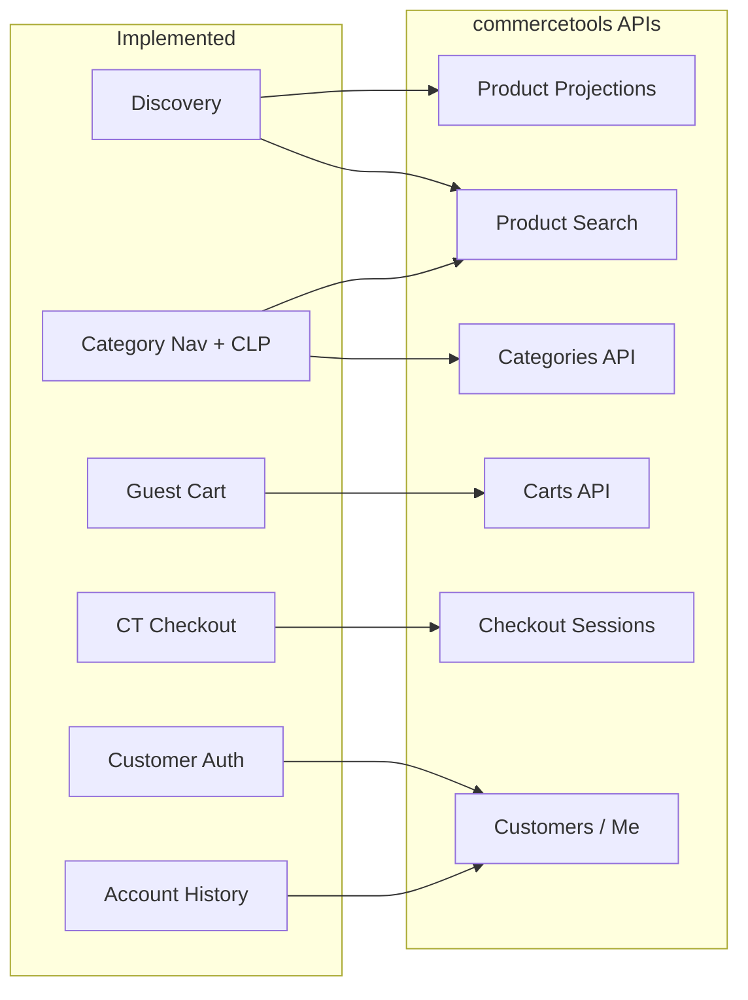
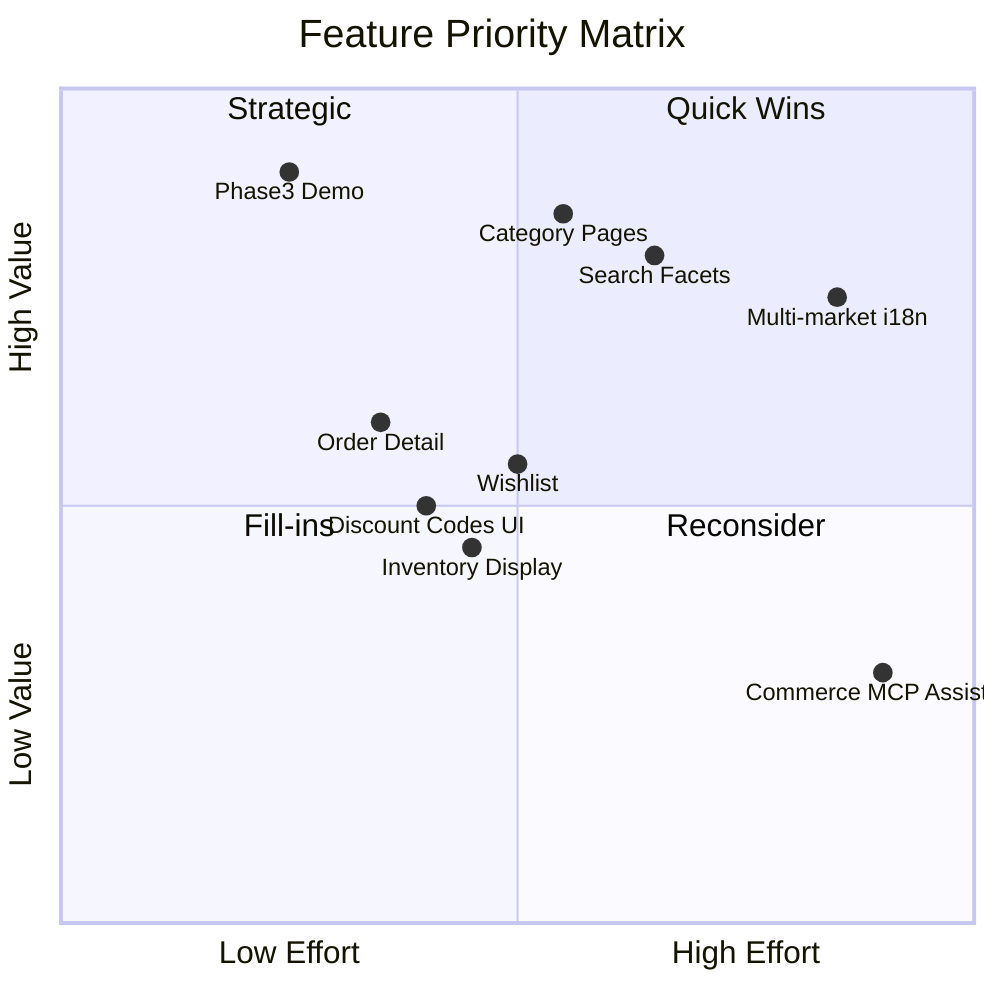

# Product Roadmap

Forward-looking plan for **zero-to-ct-storefront** — a minimal B2C PoC on commercetools sample data. Complements [BUILD_LOG.md](../BUILD_LOG.md) (history) and [AGENT_CODING.md](./AGENT_CODING.md) (phases 0–3).

**Last updated:** 2026-07-13 (Phase 4 slice 2a — listing sort + pagination + review hardening)

---

## Status snapshot

| Area | Status |
|------|--------|
| Phase 0 — CT project setup | Done |
| Phase 1 — Next.js scaffold | Done |
| Phase 2 — Discovery, cart, checkout, auth | Done |
| Phase 3 — Deploy, demo script, time report | **In progress** (E2E, docs done; deploy pending human) |
| Phase 4 — Discovery completeness | **In progress** (category nav, CLP, New Arrivals, unified listing cards, sort + pagination done; facets/autocomplete pending) |
| Phase 5+ — Feature expansion | Planned |

The storefront covers the core B2C purchase path (browse → cart → checkout → account) and category-based discovery with sortable, paginated listings. It still lacks faceted search, search autocomplete, and several capabilities from the [commercetools B2C Retail demo flow](https://docs.commercetools.com/tutorials/implementation-guide/demo-flow-b2c-retail).

---

## Current capabilities (implemented)

### Architecture

- **Next.js 16** App Router with **BFF** (`/app/api/*`) — commercetools credentials stay server-side
- **TypeScript SDK v3** (`ClientBuilder`) in [`lib/commercetools/`](../lib/commercetools/)
- **coss ui** + Tailwind v4, dark/light theme (`next-themes`)
- **CI** (`.github/workflows/ci.yml`): `lint`, `typecheck`, `test:unit`, `build` (with GitHub secrets)
- **~110 unit tests** (Vitest) + **13 E2E tests** (Playwright: discovery + cart/checkout + API smoke, local with `CTP_*`)

### Product discovery

| Feature | Route / module | commercetools API |
|---------|----------------|-------------------|
| Homepage "Best Sellers" grid | `/` | Product Projections (catalog heuristic) |
| Homepage "New Arrivals" grid | `/` | [Product Search](https://docs.commercetools.com/api/projects/product-search) (`categoriesSubTree`) |
| Category navigation (nested menu) | header `CategoryNav` | [Categories API](https://docs.commercetools.com/api/projects/categories) |
| Category Listing Page | `/category/[slug]` | Product Search (`categoriesSubTree`) + Product Projections |
| Full-text search | `/search?q=` | Product Search API |
| Search / category listing sort + pagination | `/search`, `/category/[slug]` | Product Search `sort`, `limit`, `offset` |
| Product Detail Page (images, variants) | `/product/[slug]` | Product Projections |
| Unified compact product cards + add-to-cart | `ProductCardCompact` on `/`, `/search`, `/category/[slug]` | — |
| Custom not-found page | `app/not-found.tsx` | — |

> Best sellers use a catalog heuristic (oldest products, excluding new-arrivals category) because the Orders API requires `view_orders` scope. Category listings use Product Search with `categoriesSubTree` and preserve search result order when fetching projections.

### Cart and checkout

| Feature | Route / module | commercetools API |
|---------|----------------|-------------------|
| Guest cart (create, read, update, delete items) | `/cart`, `/api/cart/*` | [Carts API](https://docs.commercetools.com/api/projects/carts) |
| Checkout embed | `/checkout` | [Checkout Session API](https://docs.commercetools.com/checkout/overview) + Browser SDK |
| Order confirmation | `/order-confirmation` | — |
| Stripe payments | via CT Connect | Payment Integrations (MC) |

See [CHECKOUT.md](./CHECKOUT.md) for MC/Connect setup.

### Customer auth and account

| Feature | Route / module | commercetools API |
|---------|----------------|-------------------|
| Login / register / logout | header dialog, `/api/auth/*` | `/login`, Customers, OAuth customer token |
| Password reset | `/reset-password`, forgot-password flow | Password token API |
| Cart merge on auth | `lib/commercetools/customer-auth.ts` | `anonymousCartSignInMode: MergeWithExistingCustomerCart` |
| Account profile + order history | `/account` | `GET /me`, `GET /me/orders` |

See [CUSTOMER_AUTH.md](./CUSTOMER_AUTH.md) for architecture and scopes.

### Shell UX

- Fixed header: category menu, search, account menu, cart badge
- Footer with navigation links
- Configurable store branding (`NEXT_PUBLIC_STORE_NAME`)
- Catalog copy in `en-GB`; purchase defaults `en-GB` / `DE` / `EUR` (see `storefront-context.ts`)

### BFF API endpoints (15 route files)

| Endpoint | Methods |
|----------|---------|
| `/api/health` | GET |
| `/api/products` | GET |
| `/api/categories` | GET |
| `/api/cart` | GET |
| `/api/cart/items` | POST |
| `/api/cart/items/[lineItemId]` | PATCH, DELETE |
| `/api/checkout/session` | POST |
| `/api/auth/login` | POST |
| `/api/auth/register` | POST |
| `/api/auth/logout` | POST |
| `/api/auth/session` | GET |
| `/api/auth/forgot-password` | POST |
| `/api/auth/reset-password` | POST |
| `/api/customer/orders` | GET |

### Architecture overview

---

## Gaps vs commercetools B2C Retail reference

Compared to the [Demo flow B2C Retail](https://docs.commercetools.com/tutorials/implementation-guide/demo-flow-b2c-retail) and [Storefront search overview](https://docs.commercetools.com/api/storefront-search-overview):

| CT reference capability | Project status |
|-------------------------|----------------|
| Category navigation + Category Listing Page | **Partial** — nav, CLP, unified cards, sort, pagination; facets pending |
| New Arrivals homepage section | Done |
| Unified product listing cards (homepage, search, category) | Done |
| Custom not-found page | Done |
| Search suggestions / autocomplete | Missing |
| Faceted filters (price, attributes) | Missing |
| Sorting and pagination on listings | Done |
| Quick View on product listing | Missing |
| Wishlist (heart icon) | Missing |
| Multi-language / country switcher | Env defaults only |
| Profile edit / change password | Documented out of scope |
| Single order detail page | Documented out of scope |
| Discount codes in storefront UI | Handled by Checkout SDK only |
| Stock availability on PDP/PLP | Not displayed |
| Real bestseller ranking | Requires `view_orders` or external analytics |

---

## Roadmap by phase

### Phase 3 — Demo readiness [P0]

**Goal:** Close the PoC for sales demos.

| Feature | Status | CT API | Suggested files | Dependencies |
|---------|--------|--------|-----------------|--------------|
| Deploy (Vercel/Netlify) | planned (human) | — | — | CT AI plugin `/deploy-vercel`; see [DEPLOY.md](./DEPLOY.md) |
| Sales demo script | done | — | [DEMO_SCRIPT.md](./DEMO_SCRIPT.md) | — |
| Time report | done | — | [TIME_REPORT.md](./TIME_REPORT.md) | `BUILD_LOG.md` entries |
| E2E: add-to-cart + checkout | done | Carts, Checkout Sessions | `e2e/cart-checkout.spec.ts` | Local `CTP_*` credentials |
| CI `pnpm build` job | done | — | `.github/workflows/ci.yml` | GitHub secrets for `CTP_*` |

**Effort:** S | **Value:** High (demo readiness)

---

### Phase 4 — Discovery completeness [P1]

**Goal:** Standard B2C product listing and category experience.

| Feature | Status | CT API | Suggested files | Dependencies |
|---------|--------|--------|-----------------|--------------|
| Category tree in navigation | done | [Categories API](https://docs.commercetools.com/api/projects/categories) | `lib/commercetools/categories.ts`, `components/layout/site-header.tsx` | — |
| Category Listing Page `/category/[slug]` | done | [Product Search](https://docs.commercetools.com/api/projects/product-search) | `app/category/[slug]/page.tsx`, `/api/categories` | Categories module |
| Faceted filters (price, color, brand) | planned | [Product Search faceting](https://docs.commercetools.com/api/storefront-search-overview#faceting) | search + category pages | Product Search |
| Sorting (price, newest) | done | Product Search `sort` | `lib/commercetools/products.ts`, `components/product/product-listing-controls.tsx` | — |
| Pagination | done | `limit` + `offset` | `app/search/page.tsx`, `app/category/[slug]/page.tsx` | — |
| Search autocomplete | planned | [Search Term Suggestions API](https://docs.commercetools.com/api/projects/search-term-suggestions) | `components/search/search-form.tsx`, `/api/search/suggestions` | — |
| New Arrivals section on homepage | done | Categories + Product Search | `app/page.tsx` | Categories module |
| Unified product listing cards | done | — | `components/product/product-card-compact.tsx`, `product-grid-compact.tsx` | Used on `/`, `/search`, `/category/[slug]` |
| Custom `not-found` page | done | — | `app/not-found.tsx` | — |

**Effort:** M–L (slice 1 done) | **Value:** High (full discovery flow)

> Use **Product Search API** for new listing code (project convention in [AGENT_CODING.md](./AGENT_CODING.md)), not Product Projection Search.

---

### Phase 5 — Account and post-purchase [P2]

**Goal:** Complete the customer journey after purchase.

| Feature | Status | CT API | Suggested files | Dependencies |
|---------|--------|--------|-----------------|--------------|
| Order detail `/account/orders/[id]` | planned | `GET /me/orders/{id}` | `app/account/orders/[id]/page.tsx` | Customer session |
| Extended profile view (addresses, registration date) | planned | `GET /me` | `app/account/page.tsx` | — |
| Profile edit | planned | `POST /me` | `/api/customer/profile` | Validation, tests |
| Change password on account page | planned | Customer password change | account components | — |
| Email delivery (ESP) | future | — | — | Connect/ESP integration; production only |

**Effort:** M | **Value:** Medium–High

---

### Phase 6 — Wishlist / Shopping Lists [P2]

**Goal:** "Save for later" aligned with B2C demo (heart icon).

| Feature | Status | CT API | Suggested files | Dependencies |
|---------|--------|--------|-----------------|--------------|
| Wishlist (add, remove, view) | planned | [Shopping Lists API](https://docs.commercetools.com/api/projects/shoppingLists), [My Shopping Lists](https://docs.commercetools.com/api/projects/me-shoppingLists) | `lib/commercetools/shopping-lists.ts`, `/api/wishlist/*` | Guest `anonymousId`; merge on login |
| Move wishlist item to cart | planned | Carts + Shopping Lists update | BFF orchestration | Cart + wishlist modules |
| Wishlist page `/wishlist` | planned | — | `app/wishlist/page.tsx` | coss ui |

**Effort:** M | **Value:** Medium (good demo differentiator)

See [Implement shopping lists](https://docs.commercetools.com/learning-implement-carts-and-shopping-lists/implement-shopping-lists/overview) learning module.

---

### Phase 7 — Pricing, promotions, and cart UX [P3]

**Goal:** Surface commercetools promotions in the storefront.

| Feature | Status | CT API | Suggested files | Dependencies |
|---------|--------|--------|-----------------|--------------|
| Display Product Discounts on PDP/PLP | planned | Product Projections (discounted price) | `product-mappers.ts`, card components | Data already in CT |
| Discount code input in cart | planned | Carts `addDiscountCode` | `components/cart/`, `/api/cart/discount-code` | Apply before checkout session |
| Discount summary in cart | planned | Cart `discountCodes`, `lineItem.discountedPrice` | `lib/commercetools/cart-mappers.ts` | — |
| Mobile cart drawer | planned | — | coss `sheet` | See [UI_COMPONENTS.md](./UI_COMPONENTS.md) |

**Effort:** M | **Value:** Medium

> Apply discount codes at the Cart level before creating a Checkout session. The Checkout Browser SDK handles payment, not coupon entry.

See [Pricing and discounts overview](https://docs.commercetools.com/api/pricing-and-discounts-overview) and [Create promotions](https://docs.commercetools.com/tutorials/implementation-guide/create-promotions).

---

### Phase 8 — Inventory and availability [P3]

**Goal:** Stock awareness on the storefront.

| Feature | Status | CT API | Suggested files | Dependencies |
|---------|--------|--------|-----------------|--------------|
| "In stock" / "Out of stock" on PDP | planned | `ProductVariant.availability` | PDP components | Eventual consistency OK for display |
| Block add-to-cart when out of stock | planned | [Inventory API](https://docs.commercetools.com/api/projects/inventory) or availability check | `add-to-cart-button.tsx` | `ReserveOnCart` or client-side check |
| Low stock messaging | future | `InventoryEntry` reorderPoint | PDP/PLP badges | Optional |

**Effort:** M | **Value:** Medium

See [Inventory overview](https://docs.commercetools.com/api/inventory-overview) and [Manage inventory with the Cart](https://docs.commercetools.com/learning-model-your-product-catalog/inventory-modeling/cart-inventory).

---

### Phase 9 — Multi-market and i18n [P4]

**Goal:** Country/language switcher as in the B2C demo. Explicitly outside PoC core scope.

| Feature | Status | CT API | Suggested files | Dependencies |
|---------|--------|--------|-----------------|--------------|
| Country/locale switcher UI | future | Store context, price selection | `lib/commercetools/storefront-context.ts` | — |
| Scoped prices per market | future | [Price selection](https://docs.commercetools.com/api/pricing-and-discounts-overview#price-selection) | Product Search scoped price | — |
| Checkout app per country | done (config) | Checkout Applications | env vars | DE vs GB/US apps already configured |

**Effort:** L | **Value:** High for multi-market; post-PoC

---

### Phase 10 — Quality, observability, and agent tooling

| Feature | Status | Notes |
|---------|--------|-------|
| SDK middleware (concurrent modification) | done | `withConcurrentModificationMiddleware()` in `lib/commercetools/client.ts` |
| SDK middleware (correlation ID) | planned | Mentioned in [TECH_STACK.md](./TECH_STACK.md) |
| E2E auth + account flows | planned | Playwright |
| Cart/checkout unit tests | partial | `POST /api/cart/items` covered; `cart-mappers` and other routes pending |
| `commerce-mcp` integration | future | Live project API from agents |
| Commerce MCP shopping assistant | future | Explicit non-goal for PoC |

**Effort:** S–M | **Value:** Developer experience

---

## Feature summary table

| Feature | Priority | Effort | Status | CT API |
|---------|----------|--------|--------|--------|
| Deploy + demo script | P0 | S | partial (deploy pending) | — |
| E2E checkout flow | P0 | S | done | Carts, Checkout Sessions |
| CI production build | P0 | S | done | — |
| Category pages + navigation | P1 | M | **partial** (nav, CLP, cards, sort, pagination done; facets pending) | Categories, Product Search |
| New Arrivals homepage section | P1 | S | **done** | Categories, Product Search |
| Unified listing product cards | P1 | S | **done** | — |
| Custom not-found page | P1 | S | **done** | — |
| Search facets | P1 | M | planned | Product Search |
| Search sort + pagination | P1 | M | **done** | Product Search |
| Search autocomplete | P1 | S | planned | Search Term Suggestions |
| Order detail page | P2 | S | planned | `GET /me/orders/{id}` |
| Profile edit / change password | P2 | M | planned | `POST /me` |
| Wishlist | P2 | M | planned | Shopping Lists |
| Discount codes in cart UI | P3 | M | planned | Carts `addDiscountCode` |
| Inventory display | P3 | M | planned | ProductVariant.availability |
| Multi-market switcher | P4 | L | future | Price selection, Stores |
| Commerce MCP assistant | — | L | future | — |
| Homepage bestsellers | — | — | **done** | Product Projections |
| Homepage new arrivals | — | — | **done** | Product Search |
| Category navigation + CLP | — | — | **partial** | Categories, Product Search |
| Search / category sort + pagination | — | — | **done** | Product Search |
| Unified listing cards | — | — | **done** | — |
| Custom not-found | — | — | **done** | — |
| Full-text search | — | — | **done** | Product Search |
| PDP with variants | — | — | **done** | Product Projections |
| Guest cart CRUD | — | — | **done** | Carts API |
| CT Checkout + Stripe | — | — | **done** | Checkout Sessions |
| Customer auth | — | — | **done** | Customers, OAuth |
| Account + order history | — | — | **done** | `GET /me/orders` |

### Priority matrix

### Recommended implementation order

1. **Phase 3** — Demo readiness (P0) — deploy remains human step
2. **Phase 4** — Search facets (P1) — next slice
3. **Phase 4** — Search autocomplete (P1)
4. **Phase 5** — Order detail + account polish (P2)
5. **Phase 6** — Wishlist (P2)
6. **Phase 7** — Discount codes + promotion display (P3)
7. **Phase 8** — Inventory availability (P3)
8. **Phase 9** — Multi-market (P4, post-PoC)
9. **Phase 10** — Agentic commerce assistant (Future)

**Phase 4 slice 1 (done):** category module, `/api/categories`, header category nav, `/category/[slug]`, New Arrivals, custom `not-found`, unified `ProductCardCompact` listings, review hardening (layout fallback, slug validation, paginated category fetch).

**Phase 4 slice 2a (done):** Product Search sort (`relevance`, `newest`, `price-asc`, `price-desc`), URL-driven pagination on `/search` and `/category/[slug]`, shared `ProductListingControls` (sort toolbar above grid, pagination below), page clamp/redirect and CT offset cap, BFF `sort` param on `/api/products`, unit + E2E coverage.

---

## Non-goals

The following remain **out of scope** for this PoC (see [AGENT_CODING.md](./AGENT_CODING.md) and [CUSTOMER_AUTH.md](./CUSTOMER_AUTH.md)):

- [commercetools Frontend](https://docs.commercetools.com/frontend-overview) (separate licensed product)
- Merchant Center Custom Applications (admin UI, not storefront)
- Voice / image search
- Production-grade caching or design system
- Store-scoped customers (B2B)
- Email verification (without ESP)
- Commerce MCP shopping assistant (future phase)

---

## References

### commercetools documentation

- [Demo flow B2C Retail](https://docs.commercetools.com/tutorials/implementation-guide/demo-flow-b2c-retail)
- [Storefront search overview](https://docs.commercetools.com/api/storefront-search-overview)
- [Product Search API](https://docs.commercetools.com/api/projects/product-search)
- [Categories API](https://docs.commercetools.com/api/projects/categories)
- [Carts API](https://docs.commercetools.com/api/projects/carts)
- [Shopping Lists API](https://docs.commercetools.com/api/projects/shoppingLists)
- [Pricing and discounts overview](https://docs.commercetools.com/api/pricing-and-discounts-overview)
- [Inventory overview](https://docs.commercetools.com/api/inventory-overview)
- [Checkout overview](https://docs.commercetools.com/checkout/overview)
- [Prepare for agentic commerce](https://docs.commercetools.com/learning-prepare-for-agentic-commerce)

### This repository

- [BUILD_LOG.md](../BUILD_LOG.md) — chronological development history
- [AGENT_CODING.md](./AGENT_CODING.md) — agent workflow and phase plan
- [CHECKOUT.md](./CHECKOUT.md) — Stripe + Checkout setup
- [CUSTOMER_AUTH.md](./CUSTOMER_AUTH.md) — auth architecture
- [TESTING.md](./TESTING.md) — test strategy
- [DEMO_SCRIPT.md](./DEMO_SCRIPT.md) — sales demo script
- [TIME_REPORT.md](./TIME_REPORT.md) — time summary (estimated)
- [DEPLOY.md](./DEPLOY.md) — deployment guide

---

## How to update this document

1. When a feature ships, change its **Status** to `done` and add a note in [BUILD_LOG.md](../BUILD_LOG.md).
2. When scope changes, update the relevant phase section and the feature summary table.
3. Keep **Non-goals** aligned with [AGENT_CODING.md](./AGENT_CODING.md).
4. Validate new CT API usage via **commercetools-knowledge MCP** before implementation.
5. Update **Last updated** date at the top of this file.
