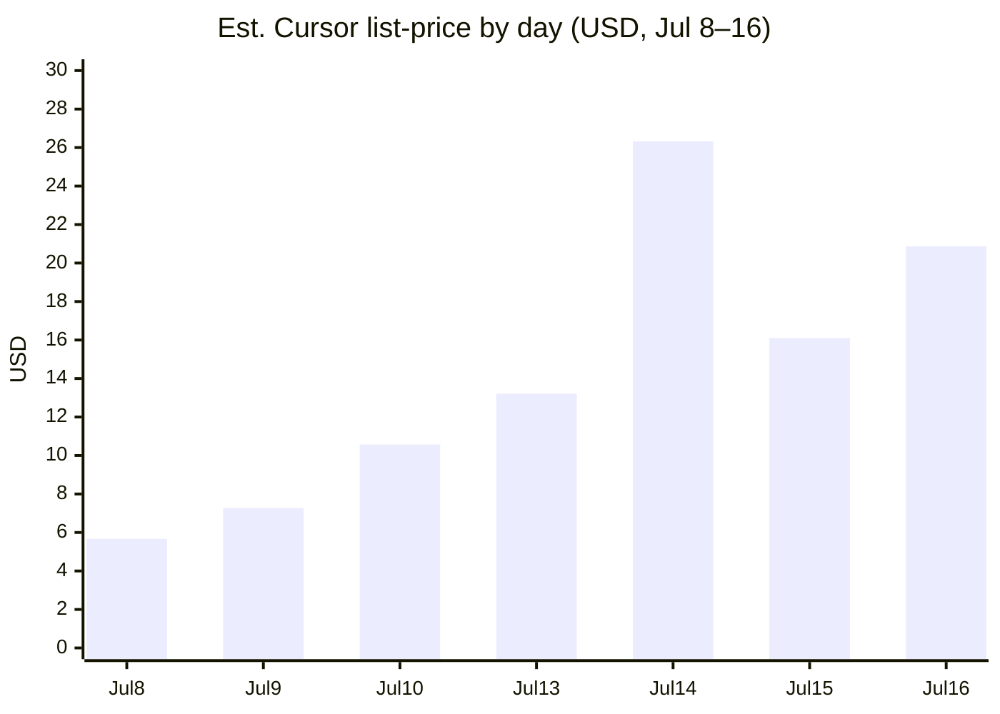
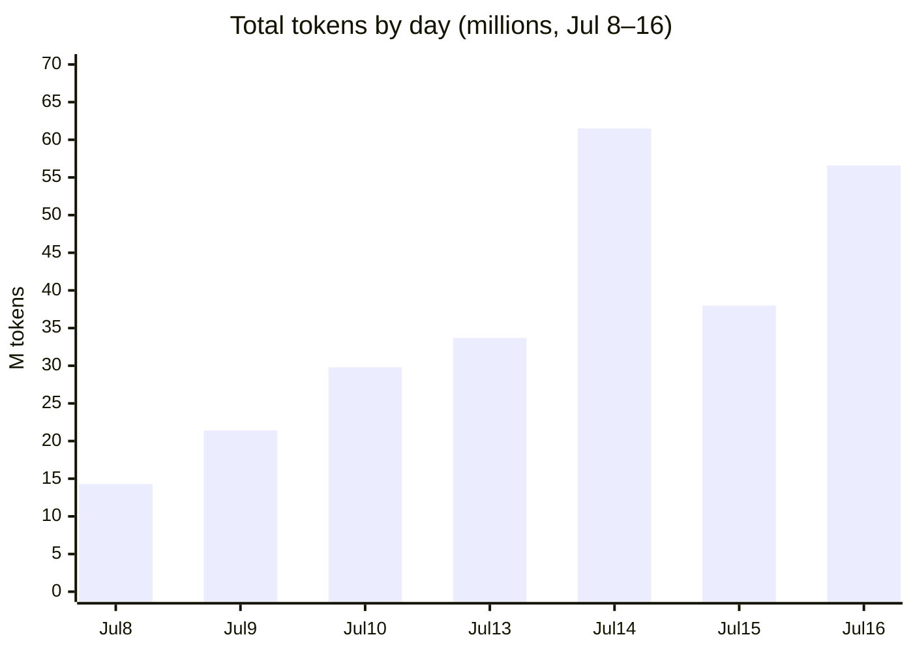
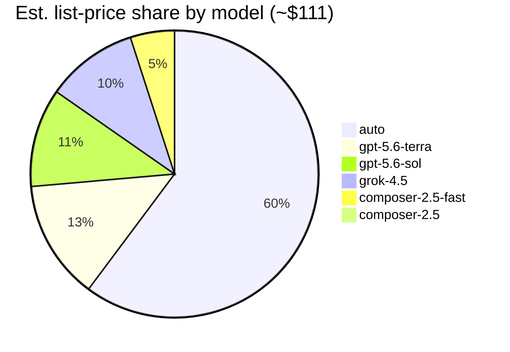
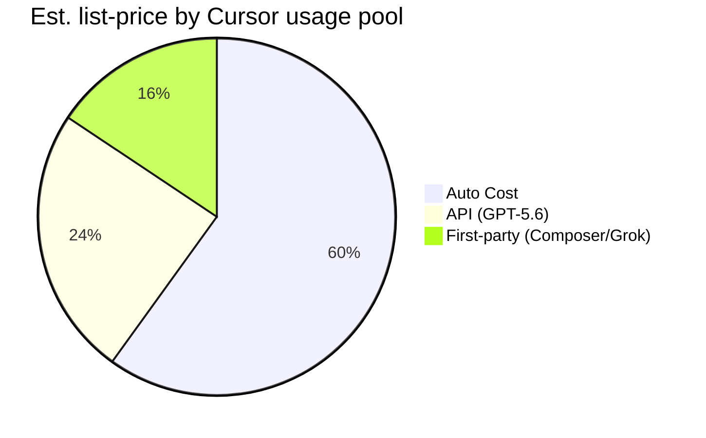
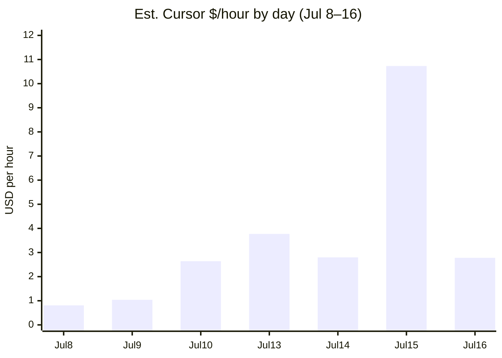

# Time report

End-of-project time summary for **zero-to-ct-storefront** sales demos. Derived from [BUILD_LOG.md](../BUILD_LOG.md) and **git commit timestamps**.

> **Status:** Estimated from BUILD_LOG + user-reported time (through 2026-07-20). Cursor usage & cost section included.

---

## Methodology

| Rule | Value |
|------|-------|
| Working window | 09:00–17:00 |
| Lunch (deducted daily) | 1h (assumed 12:00–13:00) |
| Net capacity per full day | **7h** |
| Data source | `git log --format='%ai'` (author: Tomasz Miller) |

**Per-day logic:**

1. **Day with commits** — estimate from first/last commit, capped at 7h net. If commits span only part of the window, use that span (lunch already passed when afternoon commits start).
2. **Day in BUILD_LOG without commits** — estimate as full 7h when milestone describes substantive manual work (e.g. Merchant Center / Stripe on 2026-07-09).
3. **Milestone hours** — split each day's total proportionally across BUILD_LOG entries for that date.

### Commit activity

| Date | First commit | Last commit | Commits |
|------|--------------|-------------|---------|
| 2026-07-08 | 13:26 | 16:00 | 8 |
| 2026-07-09 | — | — | 0 (MC/Stripe setup per BUILD_LOG) |
| 2026-07-10 | 12:52 | 14:50+ | 5 (+ uncommitted Phase 3 work) |
| 2026-07-13 | — | — | 0 (Phase 4 discovery slices per BUILD_LOG; user-reported 3.5h) |

### Daily totals

| Date | Calculation | Net hours |
|------|-------------|-----------|
| 2026-07-08 | Full day: morning MC/docs (no commits) + afternoon commits 13:26–16:00 → 9:00–17:00 minus 1h lunch | **7h** |
| 2026-07-09 | No commits; BUILD_LOG Stripe/Connect/MC manual work → full day estimate | **7h** |
| 2026-07-10 | Partial day: first commit 12:52 (post-lunch) through ~17:00 incl. Phase 3 docs/tests | **4h** |
| 2026-07-13 | Phase 4 discovery slices incl. facets + autocomplete (user-reported) | **3.5h** |
| 2026-07-14 | Checkout cart-session cleanup and review fixes | **0.25h** |
| 2026-07-14 | Phase 5 slice 2 — profile edit, address CRUD, change password; 170 unit + 21 E2E tests | **1.5h** |
| 2026-07-14 | Account UX polish — dismissible alerts, address dialog, wide-screen account layout | **40min** |
| 2026-07-14 | Phase 6 wishlist — shopping lists, BFF, UI, tests | **1.5h** |
| 2026-07-14 | Phase 7 remainder — mobile cart drawer | **1h** |
| 2026-07-14 | Phase 8 — inventory availability (badges, block add-to-cart, BFF guard) | **1.5h** |
| 2026-07-14 | Phase 7 promotions core (retroactive entry) | **1.5h** |
| 2026-07-14 | Phase 4 slice 3 + Phase 10 slice 1 — Quick View, correlation ID, checkout session tests | **1.5h** |
| 2026-07-15 | Checkout payment status visibility + review fixes (user-reported) | **1h** |
| 2026-07-15 | Checkout default-address shortcut (retroactive BUILD_LOG entry) | **0.5h** |
| 2026-07-16 | Phase 9 — multi-market switcher (DE/GB/US), contextual prices, cart realignment, tests, docs | **3.5h** |
| 2026-07-16 | Phase 9 review fixes — customer cart realign, error propagation, switcher UX | **0.75h** |
| 2026-07-16 | Per-market cart persistence — park/restore DE/GB/US carts, auth map sync, tests, docs | **2.25h** |
| 2026-07-16 | Phase 8 low-stock + Phase 10 BFF route tests | **1h** |
| 2026-07-20 | Phase 11 — reorder + real bestsellers (Orders ranking, BFF, UI, tests, docs) | **1.75h** |
| 2026-07-20 | PoC documentation closure — auto-deploy docs, DEMO_SCRIPT talking points, ROADMAP/TIME_REPORT sync | **0.25h** |
| **Total** | | **42.42h** |

---

## Summary

| Metric | Value |
|--------|-------|
| Project duration | 8 working days (2026-07-08 → 2026-07-20) |
| Total estimated time | **42.42h** net |
| Current phase | PoC closed (docs closure) — storefront backlog complete through Phase 11 |
| Developer profile | Backend-focused, agent-assisted (Cursor + commercetools AI plugin) |
| Agent contribution | ~85–95% of storefront code; human owns CT project, Stripe/Connect, MC config |
| Cursor overage (PoC window) | **$0** (all events `Included` / plan pools) |
| Cursor list-price equivalent | **~$100** (Jul 8–16; see [Cursor usage & cost](#cursor-usage--cost)) |

---

## Cursor usage & cost

| Rule | Value |
|------|-------|
| Source | Cursor Usage dashboard export |
| Window | **2026-07-08 → 2026-07-16** (272 chargeable events) |
| Pricing reference | [Cursor Models & Pricing](https://cursor.com/docs/models-and-pricing) |
| Cash overage | **$0** — usage covered by plan pools (`Included`) |

### Headline metrics (Jul 8–16)

| Metric | Value |
|--------|-------|
| Chargeable events | 272 |
| Total tokens | **254.7M** |
| Cache read tokens | **235.3M** (~92% of total) |
| Output tokens | **1.84M** |
| Input (no cache write) | **15.3M** |
| Input (cache write) | **2.3M** |
| On-demand / overage $ | **$0.00** |
| Est. list-price equivalent | **~$100.01** |

List-price is a **manager-facing valuation** of included usage at published per-million rates. It is **not** an extra invoice line. Plan subscription (Pro / Pro+ / Ultra) is separate.

### Estimated list-price by day

| Date | Events | Total tokens | Est. list-price |
|------|--------|--------------|-----------------|
| 2026-07-08 | 24 | 14.3M | ~$5.66 |
| 2026-07-09 | 16 | 21.4M | ~$7.27 |
| 2026-07-10 | 40 | 29.8M | ~$10.57 |
| 2026-07-13 | 40 | 33.7M | ~$13.21 |
| 2026-07-14 | 63 | 61.5M | ~$26.33 |
| 2026-07-15 | 58 | 38.0M | ~$16.10 |
| 2026-07-16 | 34 | 56.6M | ~$20.87 |
| **Jul 8–16** | **272*** | **254.7M** | **~$100.01** |
| 2026-07-17 *(excluded)* | 41 | 17.1M | ~$11.27 |
| Also recorded Jul 8–17 | 313* | 272.4M | ~$111.28 |

\*Chargeable events only (excludes 3 errored, no-charge rows). Day rows above may include those errors in the event count.

Peak agent day: **2026-07-14** (~$26 / 61.5M tokens), matching the heaviest delivery day in this report.

### By model (Jul 8–16 window + Jul 17 note)

Model mix below covers all recorded events in the window (including Jul 17); Jul 8–16 totals are within ~10% of that set.

| Model | Events | Total tokens | Est. list-price | Usage pool |
|-------|--------|--------------|-----------------|------------|
| `auto` | 208 | 183.8M | ~$66.71 | Auto Cost |
| `gpt-5.6-terra-medium` | 11 | 41.3M | ~$14.87 | API |
| `gpt-5.6-sol-medium` | 17 | 8.3M | ~$12.30 | API |
| `cursor-grok-4.5-high-fast` | 40 | 16.4M | ~$11.45 | First-party |
| `composer-2.5-fast` | 35 | 20.1M | ~$5.50 | First-party |
| `composer-2.5` | 2 | 1.9M | ~$0.45 | First-party |
| **Total** | **313*** | **272.4M** | **~$111.28** | |

\*Excludes 3 `Errored, No Charge` rows from Sol.

### Hours vs agent spend (same calendar days)

Rough intensity check: net hours from this report vs estimated list-price for overlapping days.

| Date | Net hours (this report) | Est. Cursor $ | $/hour (approx.) |
|------|-------------------------|---------------|------------------|
| 2026-07-08 | 7h | ~$5.66 | ~$0.81 |
| 2026-07-09 | 7h | ~$7.27 | ~$1.04 |
| 2026-07-10 | 4h | ~$10.57 | ~$2.64 |
| 2026-07-13 | 3.5h | ~$13.21 | ~$3.77 |
| 2026-07-14 | ~9.4h* | ~$26.33 | ~$2.80 |
| 2026-07-15 | 1.5h | ~$16.10 | ~$10.73 |
| 2026-07-16 | 7.5h | ~$20.87 | ~$2.78 |
| 2026-07-20 | 2h | — (no metered events) | — |

\*Jul 14 milestone rows sum above a single 7h day cap; treat as intense multi-slice day, not audited wall-clock.

### Caveats (Cursor section)

- **Not repo-scoped** — Cursor usage events have no workspace / GitHub project field; attribution is by PoC calendar days only.
- **Jul 17 excluded from storefront total** — ~$11.27 / 17.1M tokens that day are not a TIME_REPORT work day (possible other-repo or unlogged work). Account total through Jul 17 ≈ **$111**.
- **Jul 20 missing** — Phase 11 / docs (~2h) has no matching metered events in the recorded window (ends 2026-07-17).
- **Included ≠ free forever** — $0 overage means usage sat inside plan pools; subscription fee still applies. Auto Cost and first-party pools are priced differently from API-pool models.
- **List-price methodology** — `Input (w/o Cache Write)`, `Input (w/ Cache Write)`, `Cache Read`, and `Output Tokens` × published $/1M rates for `auto`, Composer 2.5, Grok 4.5, GPT-5.6 Terra, GPT-5.6 Sol.

---

## Milestones by phase

| Phase | Date | Milestone | Agent vs manual | Time |
|-------|------|-----------|-----------------|------|
| phase-0-setup | 2026-07-08 | Repository bootstrap; agent docs, TECH_STACK, CURSOR_SETUP | Agent docs; human GitHub repo | 1h |
| phase-0-setup | 2026-07-08 | CT demo project + API client; Product Search enabled; `.env` files; coss skill | Human — MC setup, credentials | 1.5h |
| phase-1-scaffold | 2026-07-08 | Next.js scaffold; CT SDK; `/api/health`, `/api/products`; homepage (117 products) | ~85% agent / 15% human | 2h |
| phase-2-core | 2026-07-08 | Discovery: `/search`, `/product/[slug]`, homepage bestsellers | ~90% agent | 1.5h |
| phase-2-core | 2026-07-08 | Test suite: 34 unit + 5 E2E (discovery) | ~95% agent | 1h |
| phase-2-core | 2026-07-09 | Stripe Checkout MC setup + guest cart/checkout BFF + pages | Human Stripe/MC; agent storefront | 7h |
| phase-2-core | 2026-07-10 | Checkout payment fix (`no_payment_integrations`) | Agent + manual payment test | 0.5h |
| phase-2-core | 2026-07-10 | Customer auth, account page, cart merge | ~95% agent | 1.5h |
| phase-2-core | 2026-07-10 | Product roadmap (`docs/ROADMAP.md`) | ~95% agent | 0.5h |
| phase-3-demo | 2026-07-10 | E2E cart/checkout, demo script, time report, deploy docs | ~95% agent | 1.5h |
| phase-3-demo | 2026-07-14 | Vercel production deploy + smoke test | ~70% agent / 30% human | 0.5h |
| phase-4-discovery | 2026-07-13 | Category module, CLP, header nav, New Arrivals, custom 404; code review fixes; unified product listing cards; 95 unit + 12 E2E tests | ~95% agent | 2h |
| phase-4-discovery | 2026-07-13 | Listing sort + pagination on `/search` and `/category/[slug]`; code-review hardening; 110+ unit + 13 E2E tests | ~95% agent | 1h |
| phase-4-discovery | 2026-07-13 | Faceted filters + search autocomplete; 128 unit + 15 E2E tests | ~95% agent | 0.5h |
| phase-2-core | 2026-07-14 | Checkout completion cart-session cleanup; prevent false badge reset on failed cleanup; duplicate-event guard; unit coverage | ~95% agent | 0.25h |
| phase-5-account | 2026-07-14 | Phase 5 slice 1 — order detail + extended profile | ~95% agent | 1h |
| phase-5-account | 2026-07-14 | Phase 5 slice 2 — profile edit, address CRUD, change password; 170 unit + 21 E2E tests | ~95% agent | 1.5h |
| phase-5-account | 2026-07-14 | Account UX polish — dismissible alerts (auto-dismiss + close), address add/edit dialog, responsive wide-screen layout on `/account` | ~95% agent | 40min |
| phase-6-wishlist | 2026-07-14 | Phase 6 — shopping lists, BFF, UI, move-to-cart, guest merge; 183 unit + 24 E2E tests | ~95% agent | 1.5h |
| phase-7-promotions | 2026-07-14 | Phase 7 slice 1 — product discounts + cart discount codes; 193 unit + 27 E2E tests | ~95% agent | 1.5h |
| phase-7-promotions | 2026-07-14 | Phase 7 slice 2 — mobile cart drawer (coss Sheet, responsive header) | ~95% agent | 1h |
| phase-8-inventory | 2026-07-14 | Phase 8 — stock availability badges, block add-to-cart, BFF OutOfStockError; 207 unit + 33 E2E tests | ~95% agent | 1.5h |
| phase-4-discovery | 2026-07-14 | Phase 4 slice 3 — Quick View on listing cards (coss Dialog); 216 unit + 34 E2E tests | ~95% agent | 1h |
| phase-10-quality | 2026-07-14 | Phase 10 slice 1 — correlation ID middleware + checkout session route unit tests | ~95% agent | 0.5h |
| phase-3-demo | 2026-07-15 | Checkout payment status visibility + review fixes — transaction-derived status in account, Checkout SDK theme styles, provider labels; 243 unit tests | ~95% agent | 1h |
| phase-3-demo | 2026-07-15 | Checkout default-address shortcut — copied signed-in customer defaults to the Cart before restarting Checkout | ~95% agent | 0.5h |
| phase-9-multi-market | 2026-07-16 | DE/GB/US market switcher, cookie-backed context, contextual prices, cart realignment, Checkout mapping, unit and E2E coverage | ~95% agent | 3.5h |
| phase-9-multi-market | 2026-07-16 | Review fixes — customer cart recreate on market switch, realign error propagation, dismissible market notices | ~95% agent | 0.75h |
| phase-9-multi-market | 2026-07-16 | Per-market cart persistence — cookie map, park/restore, auth claim, confirm copy, tests/docs | ~95% agent | 2.25h |
| phase-8-inventory | 2026-07-16 | Low-stock messaging (`Only X left`, threshold 5) on PDP/PLP | ~95% agent | 0.4h |
| phase-10-quality | 2026-07-16 | BFF route unit tests (auth, cart, customer, wishlist) — 320 unit tests total | ~95% agent | 0.6h |
| phase-11-post-purchase | 2026-07-20 | Reorder + real bestsellers — Orders ranking, `/api/cart/reorder`, UI, 343 unit tests, docs | ~95% agent | 1.75h |
| phase-3-demo | 2026-07-20 | PoC documentation closure — auto-deploy confirmed, Commerce MCP out of storefront scope, doc drift fixed | ~95% agent | 0.25h |
| **Total** | | | ~80% agent / ~20% manual | **42.42h** |

---

## Hours by phase

| Phase | Hours | Share |
|-------|-------|-------|
| phase-0-setup | 2.5h | 8% |
| phase-1-scaffold | 2h | 6% |
| phase-2-core | 12.25h | 38% |
| phase-3-demo | 3.75h | 9% |
| phase-4-discovery | 4.5h | 11% |
| phase-5-account | 3.17h | 7% |
| phase-6-wishlist | 1.5h | 4% |
| phase-7-promotions | 2.5h | 6% |
| phase-8-inventory | 1.9h | 4% |
| phase-9-multi-market | 6.5h | 15% |
| phase-10-quality | 1.1h | 3% |
| phase-11-post-purchase | 1.75h | 4% |
| **Total** | **42.42h** | 100% |

---

## Deliverables checklist

| Deliverable | Status |
|-------------|--------|
| Working B2C storefront (browse → cart → checkout → account) | Done |
| Category navigation + Category Listing Page (`/category/[slug]`) | Done |
| Homepage New Arrivals section | Done |
| Search / category sort + pagination | Done |
| Faceted filters + search autocomplete | Done |
| Quick View on product listings | Done |
| Custom `not-found` page | Done |
| Customer authentication + order history | Done |
| Transaction-derived payment status in account order views | Done |
| Account profile edit + address CRUD + change password | Done |
| Account UX polish (dismissible alerts, wide-screen layout) | Done |
| Wishlist (heart icon, `/wishlist`, move to cart) | Done |
| Product discounts on PLP/PDP + discount codes in cart | Done |
| Stock availability on PDP/PLP + block add-to-cart | Done |
| Low-stock messaging (`Only X left`) | Done |
| Mobile cart drawer (header, `< md`) | Done |
| DE/GB/US market switcher with contextual prices and checkout mapping | Done |
| Per-market cart persistence (park/restore via `ct_market_carts`) | Done |
| Order again / reorder from account order history | Done |
| Real bestsellers from Orders API (catalog fallback) | Done |
| Unit tests (CI) — 343 tests | Done |
| E2E discovery + cart/checkout + account + wishlist + promotions + inventory + multi-market (local) | Done |
| SDK correlation ID middleware | Done |
| BFF API route unit tests (auth/cart/customer/wishlist) | Done |
| Sales demo script | Done — [DEMO_SCRIPT.md](./DEMO_SCRIPT.md) |
| Product roadmap | Done — [ROADMAP.md](./ROADMAP.md) |
| Deploy to Vercel/Netlify | Done — https://zero-to-ct-storefront.vercel.app (auto-deploy from `main`; [DEPLOY.md](./DEPLOY.md)) |
| PoC documentation closure (option A) | Done — deploy/docs drift cleared; Commerce MCP out of storefront scope |
| This time report | Estimated from commits |

---

## Caveats

- **2026-07-13** has no git commits yet; 3.5h is user-reported for Phase 4 category discovery slice (2h), listing sort/pagination slice 2a (1h), and facets + autocomplete slice 2b+2c (0.5h); see BUILD_LOG.
- **2026-07-09** has no git commits; 7h is inferred from BUILD_LOG (Stripe connector, Checkout Applications, MC configuration).
- **2026-07-10** total may increase if work continues past 17:00 or if morning activity is added.
- **2026-07-14** includes 0.25h checkout cart-session cleanup, 1.5h Phase 5 slice 2, 40min account UX polish, 1.5h Phase 6 wishlist, 0.5h Vercel production deploy, 1.5h Phase 7 promotions core, 1h Phase 7 mobile cart drawer, 1.5h Phase 8 inventory availability, and 1.5h Phase 4 Quick View + Phase 10 quality slice (correlation ID, checkout session tests). Subsequent releases ship via Vercel auto-deploy from `main` (see [DEPLOY.md](./DEPLOY.md)).
- **2026-07-20** includes 1.75h Phase 11 (reorder + bestsellers) and 0.25h PoC documentation closure.
- **2026-07-15** has no git commits yet; 1h is user-reported for checkout payment status visibility and follow-up code review fixes; see BUILD_LOG.
- Milestone split within a day is approximate; use Clockify/WakaTime for audit-grade numbers.

### How to refine

1. Export time entries from **Clockify** or **WakaTime** tagged with phase labels.
2. Replace daily totals in the methodology table.
3. Re-split milestone rows to match tracked entries.

---

## Related docs

- [BUILD_LOG.md](../BUILD_LOG.md) — chronological dev log (source of truth)
- [AGENT_CODING.md](./AGENT_CODING.md) — agent workflow and phase plan
- [DEMO_SCRIPT.md](./DEMO_SCRIPT.md) — sales demo scenarios
- [Cursor Models & Pricing](https://cursor.com/docs/models-and-pricing) — rates used for list-price estimates in [Cursor usage & cost](#cursor-usage--cost)
